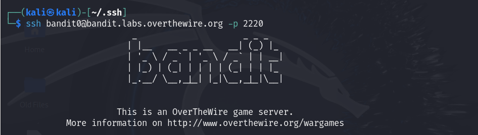

# OverTheWire - Bandit Walkthroughs & Solutions

# About
A collection of step-by-step walkthroughs and solutions for the OverTheWire - Bandit wargame. Desgined to help beginners learn Linux command line basics and cybersecurity concepts by solving real challenges.

# Why Play Bandit?
Bandit is ideal for beginners wanting hands-on practice with Linux commands, file systems, and security fundamentals. It builds your skills progressively in a  fun and interactive way.

# What You Need to Start Playing Bandit
**Basic Requirements:**
  - A computer with an internet connection.
  - SSH client installed (pre-installed on Linux/macOS; Windows users can use PuTTY or Windows Terminal with OpenSSH).
**Knowledge:**
  - Basic familiarity with Linux command line is helpful but not mandatory.
  - Willingness to learn shell commands and Linux file system navigation.

# How to Set Up and Connect
**Find te Bandit server and login info:**
  - Hostname: `bandit.labs.overthewire.org`
  - Port: `2220`
  - Usernames: start with `bandit0` and progress up (e.g., `bandit0`,`banddit1`,`bandit2`,...`banditN`)
  - Passwords: provided on the OverTheWire site or from the previous level.
**Connect using SSH:**

  - Enter the password for the current level.
  - Start solving! Each level’s password unlocks the next user.

`**Note:**` This is for the users who are playing the Bandit in VM, you may fail to connect to overthewire.org via SSH with a "broken pipeline error" when the network adapter for the VM is configured to use NAT mode. Adding in the setting IPQoS throughput to /etc/ssh/ssh_config should resolve the issue.  
If this does not solve your issue, the only option then is to change the adapter to Bridged mode.  

`i) VM Adapter -> NAT -> Add IPQoS throughput -> /etc/ssh/ssh_config`  

or

`ii) VM Adapter -> Bridged Mode`
