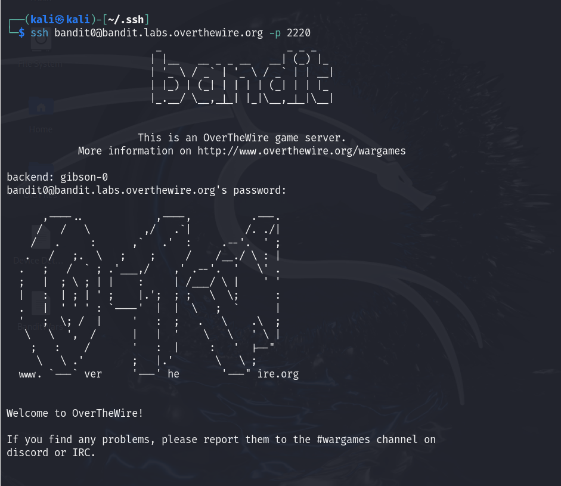
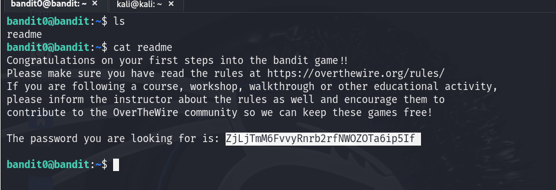

# Bandit - Level 0
**Level Goal**

The goal of this level is for you to log into the game using SSH. The host to which you need to connect is bandit.labs.overthewire.org, on port 2220. The username is bandit0 and the password is bandit0. Once logged in, go to the Level 1 page to find out how to beat Level 1.

**Reading Material**

Secure Shell (SSH) on Wikipedia: https://en.wikipedia.org/wiki/Secure_Shell

How to use SSH with a non-standard port on It's FOSS: https://itsfoss.com/ssh-to-port/

How to use SSH with ssh-keys on wikiHow: https://www.wikihow.com/Use-SSH

Level 0 Page: https://overthewire.org/wargames/bandit/bandit0.html

# Solution
Use SSH to login from the server with the following information.

Username: `bandit0`  
Password: `bandit0`  
Host: `bandit.labs.overthewire.org`  
Port: `2220`  

**Command Format:** `ssh Username@Host -p Port`  
Note: You can use IP instead of Host.  

On successful login  

Now, to proceed to the next level, complete the level goal.  

**Level Goal**  
The password for the next level is stored in a file called readme located in the home directory. Use this password to log into bandit1 using SSH. Whenever you find a password for a level, use SSH (on port 2220) to log into that level and continue the game. 

**Commands you may need to solve this level**  
`ls:` Lists files and directories.  
`cd:` Changes the current directory.  
`cat:` Displays the contents of the a file.  
`file:` Shows the file type of given file.  
`du:` Displays disk usage of files/directories.  
`find:` Searches for files and directories based on criteria.  
Note: To learn more about the commands, use the man command in the terminal.  

`man command_name` 

# Solution
Once logged-in use the appropriate commands to find the file and view the file content:
- Use `ls` to verify the file exists in the current directory.  
  `ls`

- Use `cat` to display the contents of the file.  
  `cat readme`

Password: `ZjLjTmM6FvvyRnrb2rfNWOZOTa6ip5If`  

