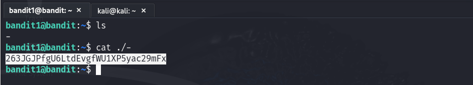

# Bandit - Level 0
**Level Goal**

The password for the next level is stored in a file called - located in the home directory

**Commands you may need to solve this level**
`ls:` Lists files and directories.  
`cd:` Changes the current directory.  
`cat:` Displays the contents of the a file.  
`file:` Shows the file type of given file.  
`du:` Displays disk usage of files/directories.  
`find:` Searches for files and directories based on criteria.  
Note: To learn more about the commands, use the man command in the terminal.  

`man command_name`

**Reading Material**

Google Search fr "dashed filename" - https://www.google.com/search?q=dashed+filename  

Advanced Bash-scripting Guide - Chapter 3 - Special Characters - https://linux.die.net/abs-guide/special-chars.html  

# Solution
Use SSH to login from the server with the following information.

Username: `bandit1`  
Password: `jLjTmM6FvvyRnrb2rfNWOZOTa6ip5If`  
Host: `bandit.labs.overthewire.org`  
Port: `2220`  

**Command:** `ssh bandit1@bandit.labs.overthewire.org -p 2220`   

Once logged-in use the appropriate commands to find the file named `-` and view the file content:
- Use `ls` to verify the file exists in the current directory.  
  `ls`

- Use `cat` the following command to view file content.  
  `cat ./-`

Password: `263JGJPfgU6LtdEvgfWU1XP5yac29mFx`  

  

`Note:` Opening a file whose name begins with a `-` can be challenging because the dash is commonly used to introduce command-line options or flags. When a command-line utility encounters a leading dash, it often interprets the following characters as an option rather than part of a filename.  
Additionally, the above is just one approach to handling this scenario; you can explore other methods to address the problem.
