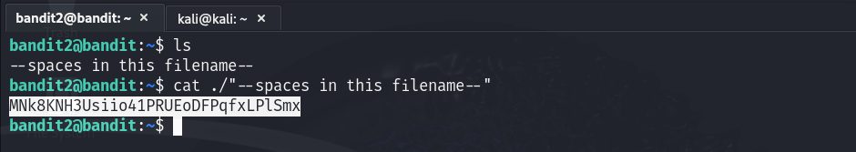

# Bandit - Level 2
**Level Goal**

The password for the next level is stored in a file called `--spaces in this filename--` located in the home directory.

**Commands you may need to solve this level**  
`ls:` Lists files and directories.  
`cd:` Changes the current directory.  
`cat:` Displays the contents of the a file.  
`file:` Shows the file type of given file.  
`du:` Displays disk usage of files/directories.  
`find:` Searches for files and directories based on criteria.  
Note: To learn more about the commands, use the man command in the terminal.  

`man command_name`

**Reading Material**

Google Search fr "dashed filename" - https://www.google.com/search?q=spaces+in+filename

# Solution
Use SSH to login from the server with the following information.

Username: `bandit2`  
Password: `263JGJPfgU6LtdEvgfWU1XP5yac29mFx`  
Host: `bandit.labs.overthewire.org`  
Port: `2220`  

**Command:** `ssh bandit2@bandit.labs.overthewire.org -p 2220`   

Once logged-in use the appropriate commands to find the file named `--spaces in this filename--` and view the file content:
- Use `ls` to verify the file exists in the current directory.  
  `ls`

- Use the following command to view file content.  
  `cat ./"--spaces in the filename--"`

Password: `MNk8KNH3Usiio41PRUEoDFPqfxLPlSmx`  

  

`Note:` To open a file with spaces in its name, enclose the file in either single or double quotes. we'll also use the previous method since the file name begins with a hypen. If the file name doesn't start with a hypen and only contains spaces, simply enclosing it in quotes is sufficient.
