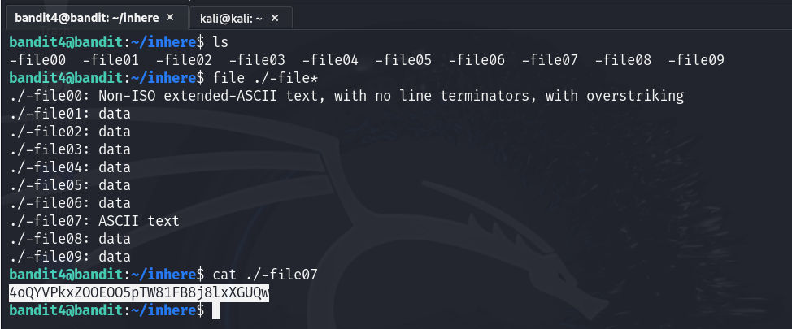

# Bandit - Level 4
**Level Goal**

The password for the next level is stored in the only human-readable file in the inhere directory. Tip: if your terminal is messed up, try the “reset” command.

**Commands you may need to solve this level**  
`ls:` Lists files and directories.  
`cd:` Changes the current directory.  
`cat:` Displays the contents of the a file.  
`file:` Shows the file type of given file.  
`du:` Displays disk usage of files/directories.  
`find:` Searches for files and directories based on criteria.  
Note: To learn more about the commands, use the man command in the terminal.  

`man command_name`

# Solution
Use SSH to login from the server with the following information.

Username: `bandit4`  
Password: `2WmrDFRmJIq3IPxneAaMGhap0pFhF3NJ`  
Host: `bandit.labs.overthewire.org`  
Port: `2220`  

**Command:** `ssh bandit4@bandit.labs.overthewire.org -p 2220`   

Once logged-in use the appropriate commands to find the directory named `inhere` and view the content of the hidden file:
- Use `ls` to verify if the intended directory is present or not.  
  `ls`
  
- Use `cd` to navigate to the `inhere` directory.  
  `cd inhere`
  
- Use the following command to view the available files.  
  `ls`
  
- Use `file` command to view the type of file.  
  `file ./-file*`  

`Note:` `*` is a wildcard used to match zero or more characters in filenames. Used in `cat ./-file*` to avoid checking or typing each file individually, as it matches all files starting with `-file`.

Password: `4oQYVPkxZOOEOO5pTW81FB8j8lxXGUQw`  

  
